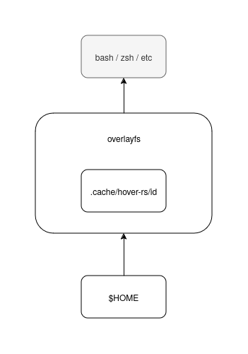

Hey! 👋

I wrote `hover-rs`, a very cool CLI tool. When you enter a `hover`, the arranges
some private mount namespaces. Every modification to files (creation, deletion
or modification) is lost when you exit hover.




```
$ hover                 # Enter hover by just running the command
You are now hovering~
  A layer is covering your /home/ayats
  You can find your top layer in: /home/ayats/.cache/hover-rs/layer-2024-06-11-0635-evCxznv

$ touch foo             # File "foo" is created under the hover

$ exit                  # Hover is just a subprocess

Leaving hover
  You can find your top layer in: /home/ayats/.cache/hover-rs/layer-2024-06-11-0635-evCxznv

$ file foo              # File "foo" is gone
foo: cannot open `foo' (No such file or directory)
```

## A note on namespaces

When you call hover, it uses the
[`clone`](https://man7.org/linux/man-pages/man2/clone.2.html) libc function,
which creates a new subprocess from process. `clone` has some settings to
customize how this process is created, and we use the namespace configuration.

"Linux Namespaces" or simply namespaces, are a special machinery of the Linux
kernel that allows the developer to dissociate parts of the execution of a whole
process. There are 5 different namespaces:

- User namespace
- Mount namesapce
- PID namespace
- Network namesapce
- IPC namesapce
- UTS (domain name) namespace

These are the primitives that all the container runtimes, like Docker or
Singularity, use the isolation of the container from the host system. For hover,
we only use the first the first two.

The **mount namespace** lets us rearrange mountpoints in a subprocess, such that
the parent process doesn't "see" these mounts. For hover, we arrange an
`overlayfs` on top `$HOME`.

The **user namespace** is only used because only root can setup a mount
namespace. With a user namespace, we can become root (can't fight with this
logic, right?). In reality, inside a user namespace, we can remap user and group
ids, such that some functionality is allowed through. For example, we can
arrange a mount namespace, and calls to `id` we show `root`, but we are not able
to modify files in `/etc`.

Another function that can arrange namespaces is
[`unshare`](https://man7.org/linux/man-pages/man2/unshare.2.html), which has its
own CLI tool that you can play with:

```
$ unshare -Umr    # -U => unshare user namespace
                  # -r => map current user to root
                  # -m => unshare mounts namespace

# id
uid=0(root) gid=0(root) groups=0(root),65534(nogroup)

# mount -t tmpfs tmpfs /var/empty

# findmnt -T /var/empty
TARGET     SOURCE FSTYPE OPTIONS
/var/empty tmpfs  tmpfs  rw,relatime,uid=1000,gid=100

# exit

$ id
uid=1000(ayats) gid=100(users) ...
```

Once the new mounts are configured, you can `unshare`/`clone` again to become
your original user and group.

## A note on overlayfs

"An overlay filesystem is a pseudo filesystem that implements a union mount for
other filesystems."
([`mount.8`](https://man7.org/linux/man-pages/man8/mount.8.html))

The overlayfs allows us to redirect writes into a path to another. The overlayfs
is composed of a sandwhich with the following elements.:

- An upperdir: where new files or modifications are written to. For example,
  after we do a `touch foo`, the file is actually stored at `upperdir/foo`.
- A lowerdir: the overlayfs shows a read-only of the lowerdir, which can be
  configured to be multiple directories stacked on top of each other.
- The mountpoint: this is where the overlayfs is exposed.
- A workdir: this is the most uninteresting. An implementation detail of
  overlayfs which we need to setup.

Overlayfs is also used by container runtimes like docker, to merge the read-only
container image (lowerdir), with any files that you create, remove or modify
within the container (upperdir). For example, you can do a `rm /usr/bin/cd`
within a container of alpine, but the original image is left unmodified in your
disk.

## Limitations

One of the problems of user namespaces, is that as an unprivileged user, you can
only map 1 group. In my machine, my user is part of many groups, that within
hover are unknown:

```
$ id
uid=1000(ayats) gid=100(users) groups=100(users),1(wheel),17(audio),19(uucp),26(video),27(dialout),57(networkmanager),62(systemd-journal),174(input),984(tss),994(incus-admin)

$ hover id
uid=1000(ayats) gid=100(users) groups=100(users),65534(nogroup)
```

This may be a problem if you interact with any of the programs that rely on this
grups. One solution could be to code hover have a "rootful" mode, but that may
defeat its purpose...

And of course, this relies on the Linux machinery, so it is not a thing on MacOS.


## Installation

The hover repo provides a Nix flake where you can get the package from.

```
nix build github:viperML/hover-rs
```

I also build statically-linked binaries that are published into github releases:
https://github.com/viperML/hover-rs/releases/tag/latest .

```
$ curl -OL https://github.com/viperML/hover-rs/releases/download/latest/hover-static-x86_64-linux
$ chmod +x hover-static-x86_64-linux
$ ./hover-static-x86_64-linux
```

Being a rust project, of course you can also build manually with `cargo`.

Have fun!
