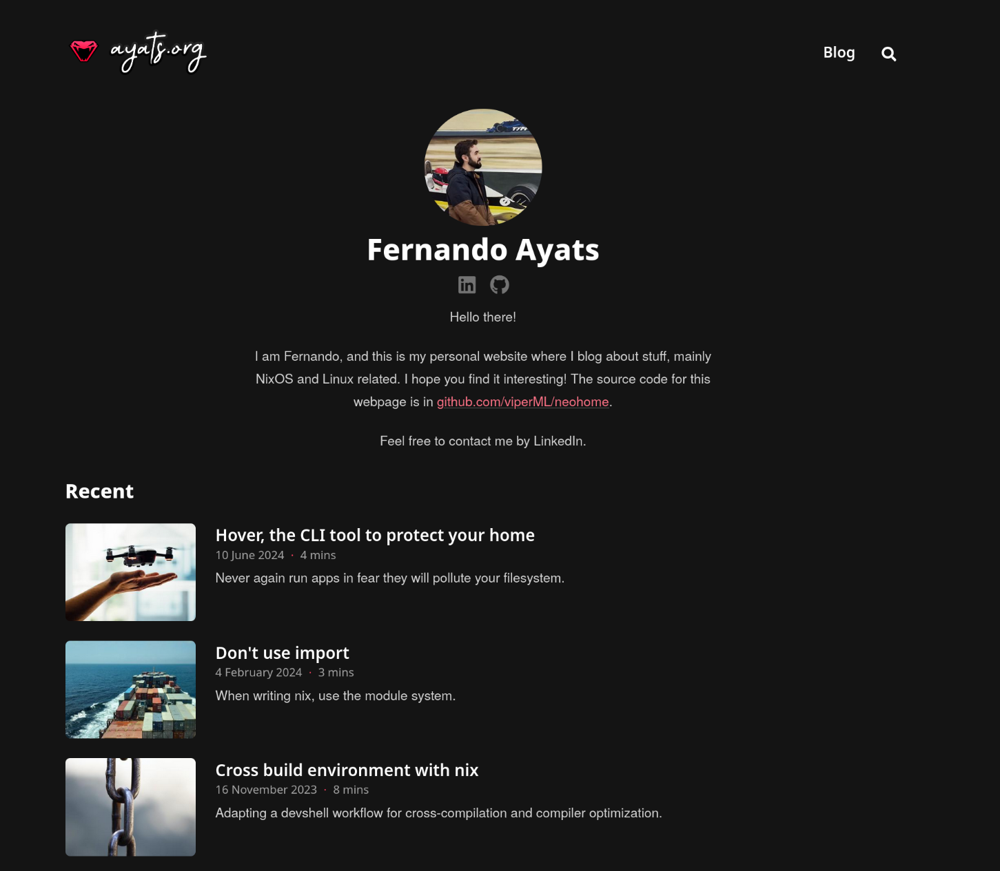

My interest for computers started back in high school, when I was given an HP
Pavilion G7. With its dual-core AMD CPU and 1600x900 screen, it was not the top
PC experience you could have, but for my younger self, it was fantastic.

I could spend hours just browsing through the UI, playing game, modding them,
and much more. I ran the default Windows (8?) installation back them. What else,
of course. I knew macOS was a thing, as some familiars had those machines. But
in my journeys going through the Windows UI, I wanted to get a better
experience.

It was back them I discovered "desktop ricing", what people called to
personalizing their desktop experience. The trend back then was having a very
minimalistic interface, with flat borders and without buttons. Looking back into
it, the lack of tools to do anything more complicated could have been the reason
for that trend.

I also wanted to do something like this for my laptop. Having a "cool" design,
that were radically different from the default Windows UI -- but still being
functional to use. As you can imagine, there were some tools to modify the
system resources, but as much as apply some paint and coating, the essence was
still the same.

So as a natural consequence, my eyes started to look into Linux. This "Free"
operating system, where you can modify any visual aspect of it. I didn't really
want to deal with systemd or the package manages, those were just tools to
having my aesthetically-pleasing desktop experience. So after what every Linux
started does -- research for hours and hours which distro to use -- I finally
landed in Manjaro.

I couldn't find any screenshot of my desktop back then, so we will have to
settle with this one from an Arch installation some time afterwards:

Time passed, and I moved into other things. Mainly, moved into investigating how
Linux really works. But in the back of my head, I still had this interest with
interface design. And what else joins interface design and software, if not Web
design?

## My old blog

At some point, a confluence of interests was met: designing a good-looking
interface, and telling stories about Nix. If you follow my block, you probably
already know what Nix, so I'll save you from the elevator pitch.

After digging throw many catalogs of templates, I landed on
[Congo](https://github.com/jpanther/congo). This template was made for
[Hugo](https://gohugo.io), a static site generator (more onto that later). After
some tweaking of the template, I got it to suit my taste.

